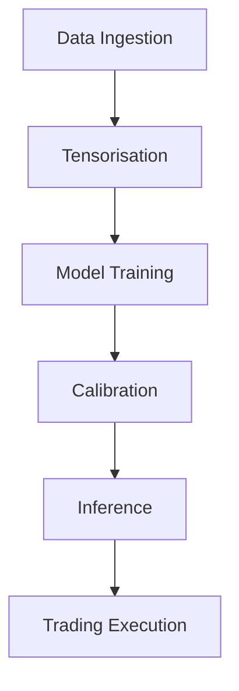

# Blueprint for a Production‑Grade Tennis In‑Play Pricing & Trading System

> **Version 0.2 – May 2025**
>
> *This document is intentionally verbose.  Each section explains not only ****what**** we do but ****why**** we do it, which risks we’re mitigating, and which questions remain open for R&D.*

---

## Overview & Glossary

### High-Level Flow Diagram



*Figure 1: Pipeline overview showing data ingestion → tensorisation → model training → calibration → inference → trading.*

### Glossary

| Acronym  | Definition                                       |
| -------- | ------------------------------------------------ |
| **EMU**  | Market-price emulator model                      |
| **OLA**  | Outcome Likelihood Aggregator (fair-value model) |
| **MTO**  | Medical Time Out                                 |
| **RMSE** | Root Mean Square Error                           |
| **SHAP** | SHapley Additive exPlanations                    |

---

## Roles & Responsibilities

- **Data Platform Team** – maintain storage, data ingestion pipelines, DVC configuration.
- **Modeling Team** – develop EMU/OLA architectures, hyperparameter sweeps, calibration logic.
- **MLOps Team** – build and tag Docker images, deploy CI/CD, monitor production.
- **Frontend Team** – implement React dashboards, SHAP visualizer, neuron heatmaps.

---

## Documentation Conventions

- **Cross-Reference Links** – use Markdown anchors for section links (e.g., see [Section 3.1](#3-storage-design--parquet-primer)).
- **Code Snippet Headers** – precede each code block with filename and purpose comments.

---

## Per-Stage “Done When…” Criteria

Embed at the end of each major section a brief checklist. For example:

> **Mission & Scope Done When:**
>
> - Exchange price emulator ≤1 ppt RMSE on validation set
> - Physics model honors pre-match closing line
> - Trust gate logic suppresses trades in low-confidence regimes

---

## Monitoring & Error Handling

- **Alerts** – configure when RMSE >1 ppt for 3 days, or inference latency >2 ms.
- **Fallback** – in case of data pipeline failure, switch to fallback data source and notify on-call.

---

## 1 Mission & Scope & Scope

Our end‑goal is a **fully automated, concept‑drift‑aware stack** that:

1. **Reconstructs the live exchange price** at every point with sub‑1 ppt RMSE (the *market‑price emulator*).
2. **Computes a structural “true” win‑prob distribution** that honours the pre‑match closing line, score tree, and serve/return skills—but *ignores* the live order book.
3. Trades **only** when (i) emulator says we “understand” the current price (low error) and (ii) fair model deviates materially from the market.

We will train two flavours of the emulator:

- **Emu‑full**: sees order‑book microstructure.
- **Emu‑lite**: sees tennis context only.

Both architectures (GRU and causal Transformer) are maintained, giving us **six models** per retrain cycle.

---

## 2 Data Sources & Rationale

### 2.1 Point‑by‑point score feeds

| Provider                 | Pros                                                                                                 | Cons                                                            | Decision                                                                      |
| ------------------------ | ---------------------------------------------------------------------------------------------------- | --------------------------------------------------------------- | ----------------------------------------------------------------------------- |
| **Sportradar**           | MTO flags, deep back‑fill to 2013, sub‑second latency.                                               | Cost (\~€6 k/yr) & bulk archive fee.                            | **Primary** source for production.                                            |
| **Goalserve**            | Affordable (€150/mo), JSON WebSocket.                                                                | MTO missing, 2019+ archive only.                                | Prototype & fallback.                                                         |
| **api‑tennis**           | Cheapest, REST & WS.                                                                                 | History < 2 yrs, inconsistent IDs.                              | Disregard for prod.                                                           |
| **Jeff Sackmann GitHub** | 70 000+ historic match CSVs, surface‑split Elo, weekly snapshots since 2000. **Free & open‑source.** | No timestamps → cannot align to tick‑level price; no live feed. | **Reference corpus** for back‑tests, serve‑stat priors, player-form features. |

> **Why Sackmann matters**
>
> - The Elo‑by‑surface files bootstrap our serve‑percentage priors for the physics model.
> - The massive historical match table lets us validate calibration of both models over two decades.
> - Serve‑/return‑stat aggregates (csv `atp_serve_%`) fill gaps when point feeds are missing.

Jeff’s data live in `/external/sackmann/` and are **left‑joined** to Sportradar matches on `player_name` + event/date before tensorisation.

### 2.2 Order‑book data Order‑book data

- **Betfair Stream API** – conflation=0 ms so we never miss a delta.
- Store *raw* deltas; derive snapshots & features post‑hoc.

### 2.3 Pre‑match closing prices

- **Pinnacle Close‑05** (median price 5 min‑4:30 before in‑play) chosen as strength prior; empirically lowest variance.

### 2.4 Historical back‑fill

- Purchase Sportradar back‑fill ZIP → S3 bucket.
- Re‑play Betfair data via *Historical Data API* (free for exchange customers) to rebuild ladders for 2018‑present.

---

## 3 Storage Design & Parquet Primer

### 3.1 Why Parquet?

- **Columnar & compressed** – Snappy or Zstandard typically shrinks raw ladder data by 10× while allowing predicate push‑down (e.g. `match_id==123`).
- **Schema‑aware** – each column stores its logical type; no CSV dtype headaches.
- **Splittable** – multiple CPU threads or Spark workers can read different row‑groups in parallel.
- **Deterministic** – identical source DF → identical Parquet bytes → perfect reproducibility.

### 3.2 Writing a Parquet file (code sample)

```python
import pyarrow as pa, pyarrow.parquet as pq

def write_aligned(df, match_id):
    table = pa.Table.from_pandas(df, preserve_index=False)
    pq.write_table(
        table,
        f"aligned/{match_id}.parquet",
        compression="zstd",
        use_dictionary=True,
        data_page_size=65536,
    )
```

Each file typically \~4 MB for a best‑of‑five, 1–2 MB for best‑of‑three.

### 3.3 Storage topology on DigitalOcean

| Option                    | Pros                                                                                 | Cons                                                             |
| ------------------------- | ------------------------------------------------------------------------------------ | ---------------------------------------------------------------- |
| **DO Spaces** (S3‑compat) | Object storage; `pyarrow.fs.S3FileSystem` works out‑of‑the‑box; versioning; low ops. | \~\$5/TB‑mo + egress; eventual consistency latency 100–300 ms.   |
| **DO Block Volume**       | Mounted ext4; ultra‑low latency; no egress cost                                      | Single‑droplet attach only (unless using NFS); manual snapshots. |
| **Postgres**              | ACID, SQL joins                                                                      | Terrible for tick‑level blob; WAL bloat; slow bulk inserts.      |

**Recommendation:** raw + processed Parquet in a **Block Volume** for training machines; nightly rsync to a Space bucket for backup.

```text
/mnt/data/raw/...          ← Block Volume
       processed/...
       backup/→ rclone → do‑space://tennis‑archive
```

```
s3://tennis/raw/...
  /betfair/<event_id>/<ts>.parquet    # raw deltas
  /score/<match_id>.json              # feed replay
s3://tennis/processed/...
  /aligned/<match_id>.parquet         # one row per point
  /tensors/<split>/{static,seq,y,mask}_<variant>.npy
```

*Aligned row schema*

| col              | dtype                             | comment            |
| ---------------- | --------------------------------- | ------------------ |
| `point_idx`      | int                               | 0…N‑1              |
| `server_is_p1`   | int8                              |                    |
| `game_score_p1`  | int8 (0‑4)                        |                    |
| `set_games_p1`   | int8                              |                    |
| `closing_logit`  | float32                           | broadcast row‑wise |
| … tennis stats … |                                   |                    |
| `best_back`      | float32                           |                    |
| `cum_size_back3` | float32                           |                    |
| `suspended_flag` | int8                              |                    |
| `mto_flag`       | int8 (explicit or heuristic)      |                    |
| `pts_since_mto`  | int16                             |                    |
| `liq_collapse`   | int8                              |                    |
| `price_for_£50`  | float32                           |                    |
| `fair_prob`      | float32 (label for physics model) |                    |
| `market_prob`    | float32 (label for emulator)      |                    |

---

## 4 Feature Engineering

### 4.1 Static vector (7 dims)

```
[ pre_prob_logit , one‑hot(best_of_five) , one‑hot(surface) ]
```

*Player embeddings (24 d diff) are optional; L2 = 1e‑4, dropout = 0.2, only if ablation shows lift.*

### 4.2 Per‑point token (\~65 dims)

- **Score tree** – server flag, game & set scores, sets won.
- **Serve stats so far** – rolling 1st‑in %, win %.
- **Boundary flags** – change‑over, set break.
- **MTO regime** – `mto_flag`, `pts_since_mto` (capped 99), `exp_decay_mto`.
- **Order‑book** – best prices, depth to £50, depth imbalance, Δsize, Δprice, suspended.
- **Residual** – `(market_prob - fair_prob_physics)` for feedback learning.

Order‑book columns are *zeroed* for **Emu‑lite** tensors.

---

## 5 Model Architectures & Hyper‑parameter Heuristics

> Layer widths follow the rule‑of‑thumb **width ≈ 2–4×√(input dims)**. With ≈65 token dims we choose 128 hidden units—large enough to avoid bottlenecks but small enough for 30 s epoch times on an H100.

### 5.1 GRU‑Seed

(unchanged…)

### 5.1 GRU‑Seed

```
static → Dense(128, SiLU) → h0
seq → TimeDense(64, SiLU) → 2‑layer GRU(128, return_sequences)
heads →
  price_hat : Dense(1, sigmoid)
  σ²_hat    : Dense(1)  (reserved for later heteroscedastic upgrade)
  distress  : Dense(1, sigmoid)  (auxil. flag)
```

### 5.2 Causal Transformer

- `n_layers=4`, `d_model=128`, `heads=4`, FF = 512, activation=SiLU.
- Static token prepended; sinusoidal positions.
- Key/Value cache for live O(1) inference.

### 5.3 Physics (“true price”) model

- **Serve → Game → Set → Match** Markov chain solved analytically each point.

- **Learned priors:** a 2‑layer MLP (128‑64‑1, SiLU) maps *surface‑specific Elo diff* + *rolling serve stats* to point‑win %.  This small NN is the only “deep” part—hence "no heavy DL" claim.

- **Distribution output:** returns the full PMF over remaining sets; game & point marginals for the next state are cached to speed live inference.

- Hierarchical analytic simulator implemented in `physics_sim.py`; differentiable but no deep learning needed.

- Outputs full distribution P(win | score) plus marginal game & set WPs; CDF numeric integration yields mean fair price.

---

## 6 Loss Functions

| Model               | Primary loss                                                                               | Rationale                                                                                                 |
| ------------------- | ------------------------------------------------------------------------------------------ | --------------------------------------------------------------------------------------------------------- |
| **Emulator (both)** | **MSE** on `price_for_£50` (**w** = 0.2 for first 10 pts post‑MTO, linear ↑ to 1 by pt20). | Point estimate good enough; manual weight avoids runaway gradients.  Heteroscedastic NLL upgrade planned. |
| **Distress head**   | BCE (`λ=0.1`)                                                                              | Helps hidden layers learn “bad day / tilt” regime.                                                        |
| **Physics model**   | Cross‑entropy on outcome (0/1) at match end + KL divergence on set outcome PMF.            | Treats the simulator like a latent variable model; parametrises serve‑win %, etc.                         |

*Over‑fit guardrails*

- Early‑stop on val RMSE plateau (patience = 5 epochs).
- Weight decay 1e‑5, dropout 0.2 on Dense and GRU outputs.
- Batch‑norm **not** used (time‑series ordering).  LayerNorm inside Transformer only.

---

## 7 Noise & Knot Handling

| Noise source           | Representation                                                             | Training strategy                                                 | Trading gate                                                              |
| ---------------------- | -------------------------------------------------------------------------- | ----------------------------------------------------------------- | ------------------------------------------------------------------------- |
| **Medical TO**         | `mto_flag`, `pts_since_mto`, `exp_decay_mto`, 0.2× loss mask first 10 pts. | Network learns different regime; fair model masked.               | Block new entries for `pts_since_mto<6`; bigger edge needed until 20 pts. |
| **Liquidity collapse** | `liq_collapse` (depth <25 % median)                                        | Same down‑weight rule; flag as low‑confidence.                    | Reject trades if collapse and cum\_size<£100.                             |
| **Spoof spikes**       | Captured in Δsize/Δprice outliers; 99th‑pct Winsorisation.                 | Robust scaler; heteroscedastic head will absorb once implemented. | n/a                                                                       |

---

## 8 Over‑fitting & Player‑ID Bias

- **Ablation** – run training with and without player‑ID diff embeddings.
- **K‑fold by player** – validation set ensures no unseen IDs cross‑contaminate.
- **Regularisation** – L2 on embeddings + dropout 0.2 on static branch.
- **Head‑to‑head leakage test** – randomly shuffle player IDs within surface buckets; if RMSE change ≪ 0.2 ppt keep embeddings, else drop.

---

## 9 Training & Evaluation Workflow

1. **Tensorise** raw matches into `tensors/emu_full` & `tensors/emu_lite`.
2. **Hydra + Optuna** sweep (40 trials) per model type on single H100 droplet.
3. **Validation metrics**
   - RMSE (price), Brier (match result), Sharpe (simulated P&L), calibration plots.
4. **Live shadow‑book** – week‑ahead run with zero stakes; ensure trust gate suppresses trading during every MTO and thin‑depth episode.

---

## 10 Deployment (DigitalOcean‑centric)

### 10.1 GPU provisioning with `pydo`

```bash
# create an 80 GB H100 droplet (hourly) and tag it "ml"
pydo compute droplet create --name=ml-trainer \
    --size=gpu.h100.80gb --region=nyc3 --image=docker-20-04 \
    --tag-names ml

# SSH, pull repo, run trainer
pydo compute droplet ssh ml-trainer --command "docker compose up trainer"

# destroy to avoid overage
pydo compute droplet delete ml-trainer --force
```

*Expected cost:* \~\$3.39 /hr; weekly sweep ≈ 4 hr → \$54/mo.

### 10.2 Docker‑Compose services

...(unchanged list)…

### 10.3 CI/CD

GitHub Actions → spins up a short‑lived H100 droplet via `pydo`; runs training; pushes artefacts to DO Spaces; destroys droplet.

- **Dockerised micro‑services** (collector, tensoriser, trainer, inference, trading bot, UI).
- **CI/CD** – GitHub Actions triggers nightly tensoriser; weekly trainer; push TorchScript to MinIO.
- **Latency** – inference engine <2 ms per point on AMD 7700X CPU.

---

## 11 UX & Wireframes

### 11.1 Live In‑Play Dashboard (MVP priority)

- **Price chart** – live market vs Emu‑full & Emu‑lite curves.
- **Score grid** – current game/set, plus hypothetical node picker (left bar = fair %, middle bar = Emu‑lite price, right bar = live price).  Clicking a node shows Δ and Kelly stake suggestion.

### 11.2 Model Explorer (phase 2)

- React Flow node graph; activation heat‑map stripe below each RNN layer.
- Hover neuron → tooltip lists top‑5 SHAP contributors & recent activation trace.

### 11.3 Tech stack

| Lib                        | Use                            |
| -------------------------- | ------------------------------ |
| **React 18 + Vite**        | front‑end scaffold             |
| **shadcn/ui + Tailwind 3** | component styling              |
| **reactflow**              | layer graph                    |
| **@visx/heatmap**          | GPU‑friendly canvas heat‑map   |
| **recharts**               | live price/time series         |
| **framer‑motion**          | smooth epoch slider animations |
| **TanStack Query**         | WS state management            |

- **Model Explorer** – React Flow graph + activation heat‑map, SHAP tooltips.
- **Score‑Grid Dashboard** – physics WPs, Emu‑lite predicted price, live market price, and Δ indicators.
- **Residual ticker** – top divergences, colour coded by trustworthiness.

---

## 12 Future R&D Roadmap

1. **Heteroscedastic Gaussian head** – remove manual 0.2 mask.
2. **Bootstrapped book micro‑sim** – optional emulator‑full grid preview.
3. **Serve‑location embeddings** via Hawk‑Eye ball‑tracking (premium data).
4. **RL staking layer** fine‑tunes stake sizing beyond Kelly fraction.

---

## 13 Codebase Diagram

```text
repo/
├ data/
│   ├ raw/           # Parquet deltas
│   ├ processed/
│   └ external/sackmann/
├ pipeline/
│   ├ align.py
│   ├ tensorise.py   # --variant emu_full/lite
│   └ physics_sim.py
├ models/
│   ├ gru.py
│   ├ transformer.py
│   └ loss.py
├ train.py           # Hydra + Optuna entrypoint
├ deploy/
│   ├ docker-compose.yml
│   └ ui.yml
├ ui/ (React)
│   ├ ModelExplorer/
│   └ ScoreDashboard/
└ tests/
    ├ unit/
    └ integration/
```

---

## 14 End‑to‑End Task Checklist

1. **Provision DO Block Volume (500 GB) & mount on all droplets.**
2. **Implement raw collectors** – Betfair & Sportradar → Parquet (`collector/`).
3. **Write ****\`\`****; unit‑test on 3 random matches** – check ≥95 % point coverage.
4. **Tensoriser v1** – generate `emu_full` tensors; verify shapes.
5. **Train GRU‑full on a single epoch** – confirm forward/backward <60 s.
6. **Add loss mask for MTO** – assert masked-loss ∼20 % lower in first 10 points post‑flag.
7. **Tensoriser‑lite** – zero book columns; sanity‑check val RMSE vs full.
8. **Optuna sweep (6 models)** – run on H100 droplet via GitHub Actions.
9. **Live shadow‑run** – zero stakes; monitor trust gate events vs MTO flags.
10. **UX Alpha** – price chart + score grid pulling from WS.
11. **Unit tests** – align; physics simulator; loss masks; trust gate logic (target thresholds in `/tests/`).
12. **Integration tests** – simulated match replay must reproduce historical RMSE ≤ 0.6 ppt.
13. **Performance test** – inference <2 ms on CPU; <0.5 s end‑to‑end latency through WS.
14. **Deploy prod docker‑compose stack** – TLS certs, Prometheus alerts.

---

## 15 Reading & Reference List

- Corral & Prieto‑Rumeau (2020) – In‑play bias study.
- Knottenbelt et al. (2012) – Monte‑Carlo tennis trees.
- Dirksen et al. (2019) – Heteroscedastic NLL in financial nets.
- Betfair Stream API & Historical API docs.
- Sportradar Tennis spec v3.2.

---

---

## 16 Calibration, Epistemology & Divergence Protection

Our project depends on maintaining a clear epistemic boundary between two predictive regimes:

- **EMU**, the emulator, predicts where the *market* will go.
- **OLA**, the outcome likelihood aggregator, models where the *true price* should be.

The tension between these is not accidental — it is the source of trading value. When the emulator and the “truth” model diverge *despite* the emulator being highly accurate, we believe we have found market error.

This creates an epistemological trap: if we allow OLA to be trained on market data too directly, we risk tautology. We will merely learn the market price again under a new name.

### Avoiding Tautology with Careful Calibration

To avoid this, we:

1. **Use dropout and input masking** to actively disrupt any tendency to over‑weight recent market prints. Market price can be included, but never trusted. Input masking randomly drops price features during training; dropout reduces model overconfidence.

2. **Train multiple OLA variants**, including:

   - One with no access to market price (pure context model)
   - One with early market signals only (e.g. pre‑injury pricing)
   - One with full price path — but calibrated *only* on divergent cases

3. **Use divergence-only calibrations** where the training set is filtered to include only instances of observed price/value divergence. The goal here is to optimize OLA’s signal detection when the market is *wrong*.

4. **Correct the global model using calibration overlays.** If our divergence‑optimized OLA differs from the global model, we apply the learned difference as a correction — like bias adjustment — but only in the live inference context that mirrors those divergences.

5. **Visualize feature contributions.** Using SHAP (via `captum`) and model explorer tooling in the React front-end, we surface exactly which features caused OLA and EMU to diverge. This builds confidence in cases where our trust gate permits action.

### Tooling, Versioning & Tracking

To ensure reproducibility and traceability for every calibration:

- **Git & GitHub/GitLab** – code version control, tagged releases per calibration run
- **Data Version Control (DVC)** – track dataset versions alongside code commits, store data artifacts in remote storage
- **Docker** – build and tag Docker images per calibration (code+env), enabling re-runs against any commit and data version
- **Hydra + Optuna** – configuration management and hyperparameter sweeps, with configs stored in Git
- **MLflow** (or **Weights & Biases**) – log experiments, metrics, parameters, models; track model artifacts and Docker image tags
- **Captum** – integrated gradients, SHAP values within runs for explainability
- **Framer Motion + ReactFlow** – animate neuron maps in the browser for visualization

Each calibration run should record:

1. Git commit hash (code)
2. DVC data version (dataset)
3. Docker image tag (environment)
4. Experiment ID in MLflow/W&B (tracking)

This stack ties code, data, and environment together, ensuring any calibration can be reproduced end-to-end.

### Visualization in UX

- When divergence arises, we plot both models’ inferred price paths against live market price
- Users can drill into SHAP explanations per prediction
- Neuron-level heatmap in ReactFlow visually indicates high-activation zones in inference

---

## Afterword: The Philosophy of Divergence

We are building a system that alerts us when the market deviates from reality.

The market aggregates more than data — it embodies sentiment, meta-knowledge, herd behavior, and occasional insight. To claim divergence is to assert that *we know better*. Our goal is not merely to mirror the market, but to discern when to trust it and when to question it.

This dual perspective is why we maintain EMU as our mirror and OLA as our compass:

- **EMU** reflects the current price belief within the market’s microstructure.
- **OLA** projects the fundamental value based on outcomes and context.

We intentionally introduce "selective amnesia" — dropout, masking, and alternate training regimes — to prevent OLA from echoing EMU. Yet we remain open to signals in price, treating them with scrutiny through calibrated filters and divergence-focused regimes.

By employing multiple OLA lenses (price-blind, time-windowed, divergence-trained), we triangulate understanding vs. noise. Only when EMU’s accurate reflection aligns with OLA’s confident signal do we execute trades.

This approach is more than just trading; it is about refining epistemic trust.

---

---

## Appendix A: Quickstart Playbook

*Placeholder for step-by-step import commands, data file formats, storage locations, and example paths. To be detailed.*

**End of Blueprint**

